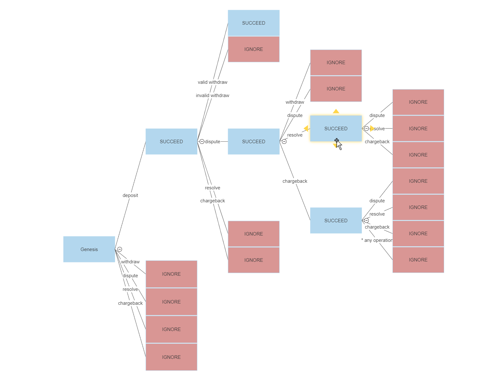

# Awesome TXpro Engine 
An Awesome 😎 tx processor engine

Each flavour is load tested against csv file containing `~56 Million (55,999,948)` records 

Have tried multiple approaches can enabled with following features
1. ###  `csv_sync`
   - `default`
   - implemented with [csv crate](https://github.com/BurntSushi/rust-csv)
   - fastest
   - can be made even faster with `--unsafe-mode` switch (please refer --help for details)
   - > run with `cargo run -- transactions.csv > accounts.csv`
   - run with faster unsafe `cargo run -- --unsafe-mode transactions.csv > accounts.csv`
2. ### `csv_async`
   - implemented with [csv-async crate](https://github.com/gwierzchowski/csv-async)
   - run with `cargo run --no-default-features --features csv_async --bin async_tx_executor -- transactions.csv > accounts.csv`
3. ### `tokio`
   - implemented with [tokio crate](https://github.com/tokio-rs/tokio)
   - run with `cargo run --no-default-features --features tokio --bin tokio_tx_executor -- transactions.csv > accounts.csv`
4. ### `rayon`
5. - ### WIP
   - implemented with [rayon crate](https://github.com/rayon-rs/rayon)
   - run with `cargo run --no-default-features --features rayon --bin rayon_tx_executor -- transactions.csv > accounts.csv`
6. ### `arrow`
   - ### WIP
   - implemented with [apache arrow crate](https://github.com/apache/arrow-rs)
   - run with `cargo run --no-default-features --features arrow --bin apache_arrow_tx_executor -- transactions.csv > accounts.csv`

Processes csv files containing transactions performed by the clients and yields the final state of all involved clients as output of the processing 

e.g. input 
```csv
type,       client, tx, amount
deposit,    1,      1,  1.0
deposit,    2,      2,  2.0
deposit,    1,      3,  2.0
withdrawal, 1,      4,  1.5
withdrawal, 2,      5,  3.0
```

expected output
```csv
client, available,  held,   total,  locked
1,      1.5,        0.0,    1.5,    false
2,      2.0,        0.0,    2.0,    false
```

## Assumptions:

- Once disputed transaction is `RESOLVED`/`CHARGEBACKED` it can't be `DISPUTE`d again
- Only `DEPOSIT` type transaction can be marked as disputed
- `DEPOSIT` / `WITHDRAWAL` of unrealistic amount (overflowing) are ignored. Has to malicious.
- `DEPOSIT` causing overflow are also ignores. Has to be malicious
- Any client with not a SINGLE valid transaction will be omitted from result.
## How To
 - Get help with  `cargo run -- --help`

 - Run with  `cargo run -- <path_to_csv_file>` 

 - Run with error to std err `cargo run -- -l <path_to_csv_file>`
  
 - Run in unsafe mode `cargo run -- -u <path_to_csv_file>`
   - thi mode almost TWICE the performance of safe mode
   - assumes the input csv has no violations of space and columns in any row 
   - any row with violations will be skipped

 - Get app version with  `cargo run -- -V`

### help preview
```
tx-processor-engine 1.1.0
Shinde Arjun
An awesome 😎 transaction processing engine

USAGE:
    tx_executor [OPTIONS] <FILE>

ARGS:
    <FILE>    path of file to process

OPTIONS:
    -h, --help           Print help information
    -l, --log-errors     Enable error logging [default: false]
    -u, --unsafe-mode    Run in unsafe mode?, considers input csv is sanitized for spaces and column
                         length. trade off between flexibility and performance. [default: false]
    -V, --version        Print version information
```


## Tests
to run all **43** tests, please run `cargo test`

## Design considerations
Following probability tree was considered while engineering the solution




## Use cases covered

### Description of cases covered
> in depth description of following cases be found [here ↗](test_input/desc.md)

The following flows have been covered
1. genesis -> deposit  
1. genesis -> withdraw
1. genesis -> dispute
1. genesis -> chargeback
1. genesis -> resolve
1. genesis -> deposit -> withdraw
1. genesis -> deposit -> dispute
1. genesis -> deposit -> resolve
1. genesis -> deposit -> chargeback
1. genesis -> deposit -> withdraw -> dispute
1. genesis -> deposit -> dispute -> dispute
1. genesis -> deposit -> dispute -> resolve
1. genesis -> deposit -> dispute -> chargeback
1. genesis -> deposit -> dispute -> withdraw
1. genesis -> deposit -> dispute -> resolve -> dispute
1. genesis -> deposit -> dispute -> resolve -> resolve
1. genesis -> deposit -> dispute -> resolve -> chargeback
1. genesis -> deposit -> dispute -> chargeback -> chargeback
1. genesis -> deposit -> dispute -> chargeback -> deposit
1. genesis -> deposit -> dispute -> chargeback -> withdraw
1. genesis -> deposit -> dispute -> chargeback -> dispute
1. genesis -> deposit -> partial_withdraw -> full_withdraw
1. deposit negative amount
1. withdraw negative amount
1. twice deposit amount that is max allowed by container type
1. deposit amount larger than max allowed by container type
1. deposit without amount
1. withdraw without amount
1. deposit without client id
1. deposit tx id
1. withdraw without client id
1. withdraw without tx id
1. dispute without client id
1. dispute without tx id
1. resolve without client id
1. resolve without tx id
1. chargeback without client id
1. chargeback without tx id
1. withdraw amount exactly f64::MAX
1. try negative number as client id
1. try client id larger than u16
1. try negative number as tx id
1. try tx id larger than u32 